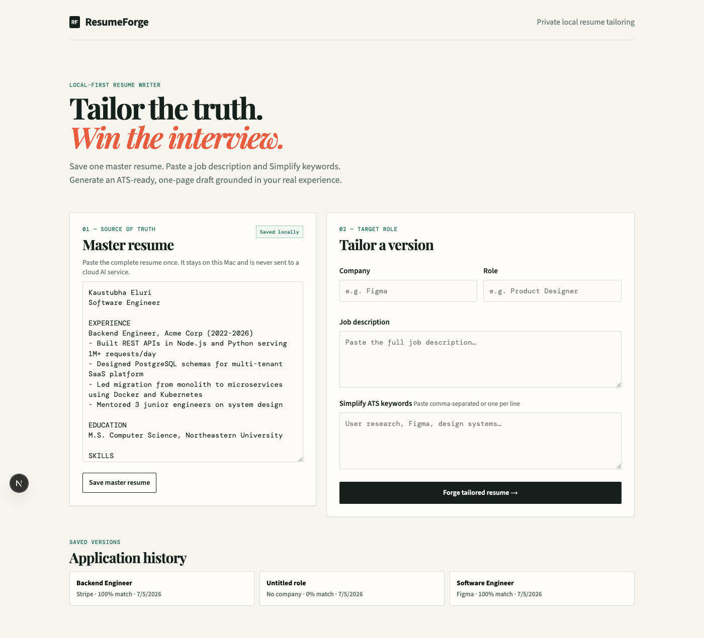
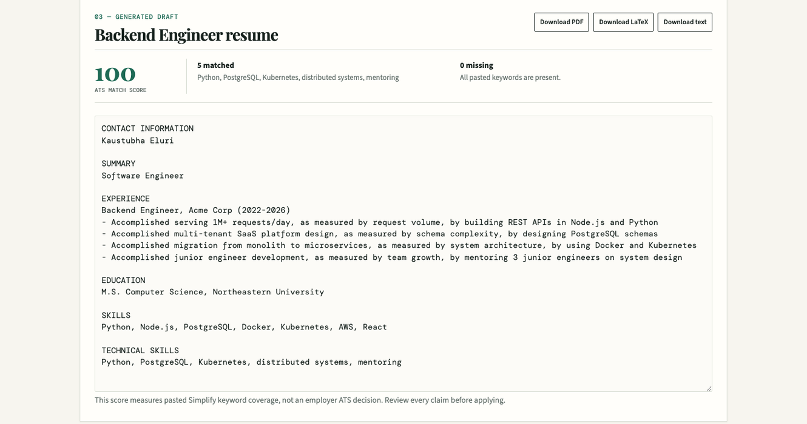

# ResumeForge

> A local-first resume tailoring tool. Paste your master resume once, paste a job description, and it generates an ATS-ready, one-page draft grounded only in facts from your real experience — with a keyword match score, LaTeX/PDF/text export, and a full history of every version you've generated.

[](https://nextjs.org)
[](https://react.dev)
[](https://www.typescriptlang.org)
[-000000)](https://ollama.com)
[-F55036)](https://groq.com)
[](https://tectonic-typesetting.github.io)

Most resume tailoring tools either paste your resume into a generic chatbot (no structure, no guardrails, no history) or lock the good parts behind a subscription. ResumeForge takes a narrower, more honest path: everything lives in a single JSON file on your Mac, the LLM is instructed to draw only from what you actually wrote (no invented metrics or job titles), and you choose whether generation happens locally (Ollama, fully private) or in the cloud (Groq, ~3s instead of a minute-plus).

---

## Screenshots

| Master resume + tailor form | Generated draft + ATS score |
|:-:|:-:|
|  |  |

Left: paste your master resume once (saved locally, never sent to a cloud AI service unless you opt into Groq), then paste a job description and target keywords. Right: the generated draft — one page, grounded only in the master resume's real experience — next to the keyword match score and PDF/LaTeX/text export buttons.

---

## Features

### Tailoring
- Paste one master resume, tailor unlimited versions against different job descriptions/companies/roles
- Generator is instructed to use only facts present in the master resume — no fabricated numbers or titles
- Every generated version is saved to history with its company, role, score, and timestamp; click any entry to restore it (including the form fields, not just the output)

### ATS keyword scoring
- Paste comma-separated or line-separated keywords from the job posting (e.g. from Simplify or the JD itself)
- Matched/missing breakdown against the generated draft, shown inline
- Explicitly scoped as a keyword-coverage signal, not a claim about how an employer's real ATS will score it

### Export
- **PDF** — server-side compilation via Tectonic (a self-contained LaTeX engine, no system LaTeX install required); paragraph-aware LaTeX escaping handles special characters (`#`, `%`, `&`, `_`) and blank-line paragraph breaks correctly
- **LaTeX** (`.tex`) and **plain text** downloads for manual editing

### Two LLM backends
- **Ollama** (default) — fully local, nothing leaves the machine, but slow on 8 GB RAM MacBooks with the default `qwen2.5:7b` model
- **Groq** (opt-in via `GROQ_API_KEY`) — cloud-hosted `llama-3.3-70b-versatile`, ~3s generation instead of a minute-plus, at the cost of sending resume + job description to Groq's API

---

## Architecture

```
                ┌──────────────────────────────┐
                │   Next.js 15 app/page.tsx    │
                │   (master resume, tailor     │
                │   form, history, PDF button)│
                └───────────────┬───────────────┘
                                │ fetch
                                ▼
        ┌───────────────────────────────────────────┐
        │  API routes (app/api/*)                    │
        │  /api/master   — read/write master resume  │
        │  /api/tailor   — generate + ATS score       │
        │  /api/pdf      — spawn tectonic, stream PDF │
        │  /api/applications — history list           │
        └──────┬──────────────────────────┬───────────┘
               │                          │
               ▼                          ▼
   ┌───────────────────────┐   ┌───────────────────────┐
   │ generateWithOllama()  │   │ generateWithGroq()     │
   │ localhost:11434       │   │ api.groq.com (cloud)   │
   │ (default)             │   │ (if GROQ_API_KEY set)  │
   └───────────────────────┘   └───────────────────────┘
               │                          │
               └────────────┬─────────────┘
                             ▼
               ┌───────────────────────────┐
               │ data/resumeforge.json     │
               │ (master resume + history) │
               └───────────────────────────┘
```

---

## Setup

### Run it — local (Ollama, private)

```bash
cd ~/Desktop/ResumeForge
ollama serve
```

In a second terminal window:

```bash
ollama pull qwen2.5:7b
npm run dev
```

Open [http://localhost:3000](http://localhost:3000).

For an 8 GB MacBook Air, the default `qwen2.5:7b` can be slow/heavy; close memory-heavy apps before generating, or use a lighter model:

```bash
OLLAMA_MODEL=qwen2.5:3b npm run dev
```

### Run it — cloud (Groq, faster, not private)

Set `GROQ_API_KEY` in `.env.local` (get a free key at [console.groq.com](https://console.groq.com)). When this is set, the app uses Groq instead of Ollama automatically — **your resume and job description are sent to Groq's API**, not kept local. Optionally set `GROQ_MODEL` to override the default (`llama-3.3-70b-versatile`).

```bash
npm run dev
```

### PDF export

Requires `tectonic` on `PATH` (a self-contained LaTeX engine — no separate LaTeX distribution needed). If Homebrew is unavailable or its tap is untrusted, download a release binary directly from [tectonic-typesetting/tectonic](https://github.com/tectonic-typesetting/tectonic/releases).

---

## Design decisions worth knowing

- **Server-side PDF, not client-side.** LaTeX compilation via Tectonic runs in `/api/pdf`, writing to a temp directory that's cleaned up in a `finally` block regardless of success or failure — keeps the browser bundle free of a LaTeX/WASM toolchain.
- **Paragraph-first LaTeX escaping.** `lib/latex.ts` splits on blank lines *before* joining lines with `\\`, rather than a two-pass regex replace — the naive two-pass approach double-processes inserted `\par` newlines into invalid `\\` sequences whenever the input has a paragraph break.
- **No cloud call unless explicitly opted in.** Groq only activates when `GROQ_API_KEY` is set; the default path never leaves the machine.

---

*Built by [Kaustubha Eluri](https://github.com/Kaustubha-09).*
